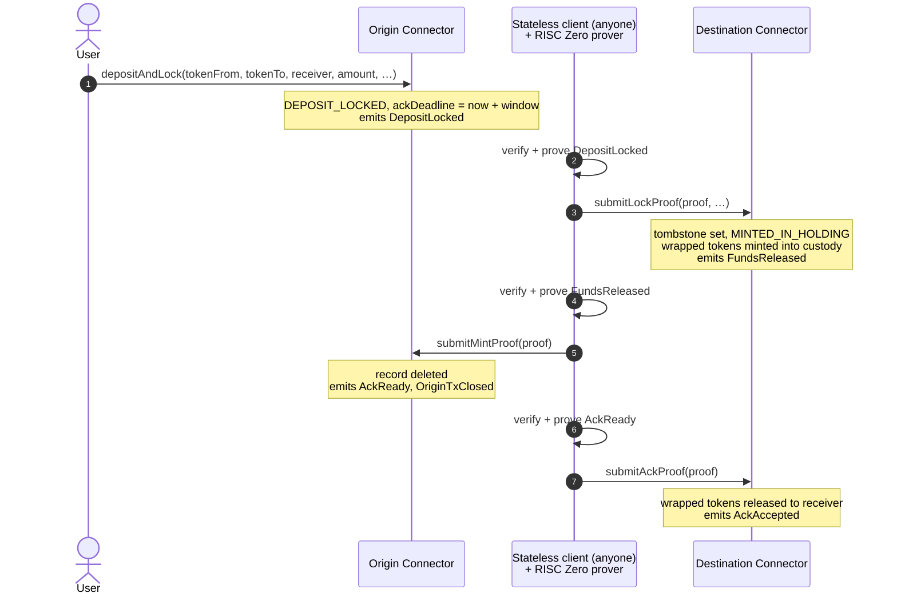
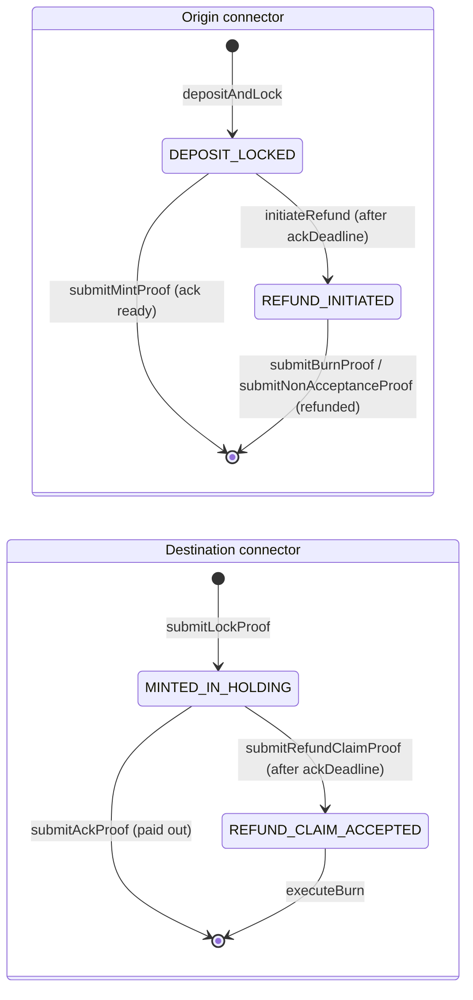
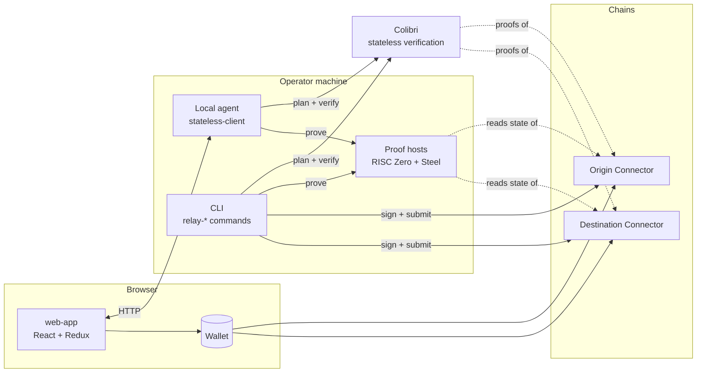

<div align="center">

# Resumable ZK Cross-Chain Transfers

### A Resumable Zero-Knowledge Cross-Chain Transfer Protocol with Stateless Coordination

**Move tokens between EVM chains without trusting a relayer as the final authority.**
Every cross-chain step is authorized by a route-specific RISC Zero proof, and any party can
resume an interrupted transfer from public on-chain state alone.

[](https://github.com/fiit-ba/A-Resumable-Zero-Knowledge-Cross-Chain-Transfer-Protocol-with-Stateless-Coordination/actions/workflows/ci.yml)
[](LICENSE)
[](smart-contracts)
[](https://book.getfoundry.sh)
[](#security-and-verification)
[](zk-proofs)
[](stateless-client)
[](smart-contracts/certora)

[How it works](#how-it-works) ·
[Quick start](#quick-start) ·
[Performance](#performance) ·
[Security](#security-and-verification) ·
[Trust model](#trust-model) ·
[Roadmap](#roadmap)

<sub>Research prototype · Faculty of Informatics and Information Technologies, Slovak University of Technology in Bratislava</sub>

</div>

---

## Why this exists

Custodial and multisignature bridges concentrate control over locked assets in a few signers.
Relay and oracle designs still depend on an external party to attest that a remote event
happened. Optimistic bridges need an honest watcher online throughout the dispute window. Each
of them, in the end, trusts someone off-chain.

This project asks:

> **Can a cross-chain transfer remain safely recoverable if any off-chain coordinator may
> disappear at any stage?**

The protocol answers by giving custody, correctness and liveness to three separate components:

| Concern | Component | What it does |
| --- | --- | --- |
| **Custody** | Connector contracts | Hold assets, enforce the transfer state machine and the acknowledgement window, verify proofs, and block replay. The same contract is deployed on both chains. |
| **Correctness** | Route-specific ZK proofs | Each route proves one fact about the other chain: an event such as `DepositLocked` or `AckReady`, or, for non-acceptance, a storage value. Proofs are bound to the route and to the live transfer. |
| **Liveness** | Stateless client | Rebuilds the next valid action from connector storage and event history, then proves and submits it. It keeps no authoritative database, so any instance can pick up where another stopped. |

Operator interfaces (a CLI, a local agent and a browser app) run the stateless client locally.
There is no hosted relayer backend; the interfaces only prepare, sign and submit transactions.

### Key properties

| | |
| --- | --- |
| 🔐 **Proof-verified, not trusted** | Every cross-chain transition is a RISC Zero Groth16 proof over EVM data read with [Steel](https://github.com/boundless-xyz/steel). The connector checks the route's image ID and recomputes the commitment from its own stored transfer before any custody change. |
| ♻️ **Resumable by anyone** | A pure planner maps `(origin status, destination status, event history)` to the next action. After the deposit every stage is permissionless, including starting a refund once the deadline has passed, so any client can finish a transfer. |
| ↩️ **Always recoverable** | An expired transfer is refunded by burning the destination's held tokens, or, if the destination never accepted the lock, by proving that it never did. |
| 🛰️ **Colibri-first evidence** | Before proving, the client checks the triggering event and state with [Colibri](https://github.com/corpus-core/colibri-stateless) stateless proofs. On local dev chains, and by default for known Chiado Colibri failures, it falls back to plain RPC and marks the verification as degraded. |
| 🧱 **Defence in depth** | 100% line and branch coverage of the contracts, Echidna and Medusa invariants, Certora rules, Slither, and timelocked admin operations. |

---

## How it works

The same `Connector` contract runs on both chains. For a given transfer, one deployment acts as
the **origin** and the other as the **destination**.

### Happy path: lock → mint → ack



The destination keeps the minted tokens in its own custody until the origin *acknowledges* the
mint, and that acknowledgement is itself proven. `FundsReleased` marks acceptance of the lock,
not delivery to the receiver.

### Refund paths

If the transfer has not been acknowledged by `ackDeadline`, anyone can call `initiateRefund` on the
origin. The refund is always paid to the original sender, so a third party can only move an expired
transfer onto the refund path. How the refund completes depends on how far the destination got:

| Destination state | Refund route |
| --- | --- |
| Lock accepted (`MINTED_IN_HOLDING`) | `submitRefundClaimProof` → `executeBurn` burns the held tokens → `submitBurnProof` returns the original asset |
| Lock never accepted | `submitNonAcceptanceProof` proves the destination's lock tombstone was still unset after the deadline, and the origin returns the original asset |

### Deadlines and branch exclusivity

The acknowledgement window is enforced only while competing branches are still possible:

- **Before `ackDeadline`**, the destination accepts lock proofs and the origin accepts mint proofs.
- **After `ackDeadline`**, the origin accepts `initiateRefund` from any caller and the destination accepts
  refund-claim proofs.
- **`submitAckProof` has no deadline.** Once the mint proof lands, the origin deletes its record,
  so a refund can no longer start. Accepting the ack late keeps the transfer live even if every
  client goes offline in between.

The branches cannot both complete. Ack and burn-refund both need the destination in
`MINTED_IN_HOLDING`, but under opposite deadline conditions. The non-acceptance route needs the
permanent `destinationLockAccepted[txId]` tombstone to be unset, and because the destination
rejects locks after the deadline, a post-deadline proof that it is unset shows the lock can
never happen. The same tombstone stops a `txId` from re-entering the lock stage after cleanup.

### What binds a proof to a transfer

Each RISC Zero payload carries `(seal, imageId, journalDigest)`. The receiving connector:

1. checks that `imageId` is the image ID pinned for that route;
2. verifies the proof through the route's verifier adapter;
3. recomputes the expected commitment from its own stored transfer, including both chain IDs.
   Lock proofs also bind the copied `ackDeadline` and the canonical wrapped-token route.

A valid proof therefore cannot be replayed on another route, connector, or transfer. Refund
routes that observe the other chain wait an additional per-chain finality delay δ(c), so the
observed block cannot be reorganized away.

### Transfer state machine



### Stateless coordination

The client never asks "what did I do last?". It asks the chains. `planRelayResume` reads both
connector statuses and, only where needed, the deadline or a bounded window of event logs:

| Origin status | Destination status | Next action |
| --- | --- | --- |
| `DEPOSIT_LOCKED` | `NONE` | **lock**, or **refund-initiate** once `ackDeadline` has passed |
| `DEPOSIT_LOCKED` | `MINTED_IN_HOLDING` | **mint**, or **refund-initiate** once `ackDeadline` has passed |
| `NONE` | `MINTED_IN_HOLDING` | **ack**: proven from the `AckReady` event, since the origin record is already deleted |
| `REFUND_INITIATED` | `MINTED_IN_HOLDING` | **refund-claim** |
| `REFUND_INITIATED` | `REFUND_CLAIM_ACCEPTED` | **execute-burn** |
| `REFUND_INITIATED` | `NONE` | **burn-proof** if `DestTxClosed` was emitted, otherwise **non-accept-proof** |
| `NONE` | `NONE` | **done** if transfer events exist, otherwise *unknown txId* |

Proof stages run one shared pipeline: verify the evidence, choose the execution block, run the
route's RISC Zero workspace, check the proof output against connector state, and build the
contract call. Direct stages (`refund-initiate`, `execute-burn`) skip straight to the call. The
CLI, the local agent and the web app all use the same stage registry.

---

## Quick start

### Prerequisites

| Tool | Used for |
| --- | --- |
| [Foundry](https://book.getfoundry.sh/getting-started/installation) (`forge`, `anvil`, `cast`) | Contracts, tests, local chains |
| Node.js `^20.19` or `>=22.12` | Relay client, local agent, web app |
| [RISC Zero toolchain](https://dev.risczero.com/api/zkvm/install) (`rzup`) **or** Docker | Generating proofs locally, or inside the bundled prover image |
| A browser wallet (MetaMask or another EIP-1193 wallet) | Signing transactions in the web app |

### 1. Build and test the contracts

```bash
cd smart-contracts
make install        # fetches forge-std and risc0-ethereum at the versions pinned in foundry.lock
forge build
forge test
```

### 2. Deploy to two local chains

Start two chains in separate terminals. The second one stands in for the `local-hardhat` profile.

```bash
anvil --port 8545 --chain-id 31337   # origin      (profile: local-anvil)
anvil --port 8546 --chain-id 31338   # destination (profile: local-hardhat)
```

Deploy tokens, connectors and wrapped-token factories, then register the token route on both
chains. Local connectors are wired to mock ZK verifiers.

```bash
cd smart-contracts
# Anvil's first dev account — public, never use it on a real network.
export PRIVATE_KEY=0xac0974bec39a17e36ba4a6b4d238ff944bacb478cbed5efcae784d7bf4f2ff80

make deploy-all
make addresses      # lists every deployed contract

# On fresh Anvil chains the deployed addresses are deterministic:
make bootstrap \
  SOURCE_CONNECTOR=0x0165878A594ca255338adfa4d48449f69242Eb8F \
  DEST_CONNECTOR=0x0165878A594ca255338adfa4d48449f69242Eb8F \
  SOURCE_TOKEN=0x5FbDB2315678afecb367f032d93F642f64180aa3 \
  DEST_WRAPPED_TOKEN=0x5FbDB2315678afecb367f032d93F642f64180aa3 \
  SOURCE_WRAPPED_TOKEN_FACTORY=0x5FC8d32690cc91D4c39d9d3abcBD16989F875707 \
  DEST_WRAPPED_TOKEN_FACTORY=0x5FC8d32690cc91D4c39d9d3abcBD16989F875707
```

### 3. Make a transfer and relay it

Deposit on the origin chain:

```bash
CONNECTOR=0x0165878A594ca255338adfa4d48449f69242Eb8F
TOKEN=0x5FbDB2315678afecb367f032d93F642f64180aa3
RECEIVER=0x70997970C51812dc3A010C7d01b50e0d17dc79C8
AMOUNT=1000000000000000000
DEPOSIT_LOCKED=$(cast sig-event 'DepositLocked(bytes32,address,address,uint256,address,address,address,address,uint64,uint64,uint256,uint256,uint256)')

cast send $TOKEN 'mint(address,uint256)' $(cast wallet address --private-key $PRIVATE_KEY) $AMOUNT --private-key $PRIVATE_KEY
cast send $TOKEN 'approve(address,uint256)' $CONNECTOR $AMOUNT --private-key $PRIVATE_KEY
TX_ID=$(cast send $CONNECTOR 'depositAndLock(address,address,address,uint256,address,uint256)' \
    $TOKEN $TOKEN $RECEIVER $AMOUNT $CONNECTOR 31338 --private-key $PRIVATE_KEY --json |
  jq -r --arg topic "$DEPOSIT_LOCKED" '.logs[] | select(.topics[0] == $topic) | .topics[1]')
echo "txId: $TX_ID"
```

Then relay it. Each `relay-resume` reads both chains, runs the one stage that is due, and prints
`plannedAction`. Repeat until it reports `noop`: that's lock, then mint, then ack.

```bash
cd ../stateless-client && npm ci && npm run build
node dist/cli.js relay-resume --tx-id $TX_ID --private-key $PRIVATE_KEY --proof-backend local \
  --source-connector $CONNECTOR --destination-connector $CONNECTOR \
  --source-profile local-anvil --destination-profile local-hardhat
```

Use `--proof-backend docker` to prove inside the bundled image instead of a local RISC Zero
toolchain. To exercise the refund path instead, deposit, relay the lock stage, then move both
chains past the one-hour ACK window before resuming. `relay-resume` then walks through
refund-initiate, refund-claim, execute-burn and burn-proof:

```bash
for rpc in http://127.0.0.1:8545 http://127.0.0.1:8546; do
  cast rpc --rpc-url $rpc evm_increaseTime 3700 && cast rpc --rpc-url $rpc evm_mine
done
```

### 4. Relay from the browser

```bash
cd stateless-client && npm ci && npm run dev:agent   # local agent on http://localhost:7549
cd web-app          && npm ci && npm run dev         # UI on http://localhost:5173
```

The web app sends `depositAndLock` from your wallet and registers the transfer with the local
agent. The agent prepares each stage (verification plus proof), and your wallet signs and submits
it. Manual mode lets you prepare any stage explicitly, and **Developer recovery** rebuilds a job
from nothing but its `txId`. The network picker lists public networks only; local chains are
driven through the CLI as shown in step 3.

---

## Architecture



| Path | What lives there |
| --- | --- |
| [`smart-contracts/`](smart-contracts) | `Connector` state machine and custody, `WrappedTokenFactory`, RISC Zero and snarkjs verifier adapters, Foundry scripts and tests, Certora specs, fuzzing harnesses |
| [`zk-proofs/risc_zero/`](zk-proofs) | Six guest programs (lock, mint, ack, refund-claim, burn, non-accept), each with a host CLI and a Docker wrapper |
| [`stateless-client/`](stateless-client) | TypeScript library and `stateless-client` CLI: planner, Colibri verification, proof orchestration, and the local HTTP agent |
| [`web-app/`](web-app) | Operator UI for depositing, tracking, and signing relay stages |
| [`scripts/`](scripts) | E2E orchestration scripts. Their deployment step predates the current contracts, so use the [quick start](#quick-start) until they are updated. |

### Supported networks

| Profile | Chain ID | Kind |
| --- | ---: | --- |
| `local-anvil` / `local-hardhat` | 31337 / 31338 | Local development |
| `sepolia`, `holesky`, `hoodi` | 11155111, 17000, 560048 | Ethereum testnets |
| `chiado` | 10200 | Gnosis testnet |
| `mainnet`, `gnosis` | 1, 100 | Mainnets (configuration only; see the disclaimer below) |


---

## Performance

Measured with Ethereum Sepolia as the origin and Gnosis Chiado as the destination.
Proofs were generated on a MacBook Pro (Apple M4 Pro, 14 cores, 48 GB RAM); each time is based
on 100 runs.

| Branch | Stage sequence | Proving time | End-to-end |
| --- | --- | ---: | ---: |
| Happy path | `depositAndLock` → `submitLockProof` → `submitMintProof` → `submitAckProof` | 39 min 27 s | **40 min 11 s** |
| Burn refund | `initiateRefund` → `submitRefundClaimProof` → `executeBurn` → `submitBurnProof` | 17 min 30 s | **17 min 31 s** |
| Non-acceptance refund | `initiateRefund` → `submitNonAcceptanceProof` | 3 min 30 s | **4 min 20 s** |

<details>
<summary>Per-route proving time and gas per entry point</summary>

| Proof stage | Proves | Time |
| --- | --- | ---: |
| `lock` | `DepositLocked` on origin | 20 min 29 s |
| `mint` | `FundsReleased` on destination | 4 min 2 s |
| `ack` | `AckReady` on origin | 14 min 56 s |
| `refund-claim` | `RefundClaimed` on origin | 15 min 27 s |
| `burn-proof` | `DestTxClosed` on destination | 2 min 3 s |
| `non-accept-proof` | destination state at `ackDeadline` | 3 min 30 s |

| Entry point | Path | Network | Gas |
| --- | --- | --- | ---: |
| `depositAndLock` | happy / refund | Sepolia | 355,205 |
| `submitLockProof` | happy | Chiado | 638,014 |
| `submitMintProof` | happy | Sepolia | 296,346 |
| `submitAckProof` | happy | Chiado | 320,104 |
| `initiateRefund` | refund | Sepolia | 43,634 |
| `submitRefundClaimProof` | burn refund | Chiado | 317,913 |
| `executeBurn` | burn refund | Chiado | 90,524 |
| `submitBurnProof` | burn refund | Sepolia | 300,527 |
| `submitNonAcceptanceProof` | non-acceptance refund | Sepolia | 305,739 |

The happy path totals 1,609,669 gas (651,551 on Sepolia and 958,118 on Chiado). The burn refund
adds 752,598 gas on top of the shared lock stages. The `initiateRefund` figure predates it becoming
permissionless; dropping the sender check makes it slightly cheaper.

</details>

Proof generation, not transaction inclusion, dominates latency. That is the price of replacing
trusted relayer attestations with cryptographic evidence.

---

## Security and verification

| Layer | What it covers | Run it |
| --- | --- | --- |
| Unit, scenario and E2E tests | Every entry point, events, state transitions, replay protection, route binding, ACK-window behaviour. **100% line and branch coverage** of all contracts. | `forge test`, `make coverage` |
| Property fuzzing | Echidna and Medusa invariants: origin solvency, no token inflation, nonce monotonicity, tombstone permanence, no dual origin or destination status | `make echidna`, `make medusa` |
| Formal verification | Certora rules for state-transition safety, branch exclusivity, custody preservation, route binding, and replay and cleanup safety | [`smart-contracts/certora`](smart-contracts/certora/README.md) |
| Static analysis | Slither and Solhint; only low and informational findings | `make slither`, `make lint-sol` |
| Tool-assisted audit | Nemesis, EVMBench-style and GPT-based reviews, with no critical or high findings. One informational note: image IDs cannot be updated after deployment. | [`nemesis-verified.md`](smart-contracts/.audit/findings/nemesis-verified.md) |
| Relay client and UI | Vitest, ESLint and `tsc` across planner, verification, proof runner, agent and web app | `npm test`, `npm run lint`, `npm run typecheck` in each package |

All `make` targets run from `smart-contracts/`.

### Continuous integration

[`.github/workflows/ci.yml`](.github/workflows/ci.yml) runs on every pull request and every push
to `main`. A change is green only if all of these pass:

| Job | Checks |
| --- | --- |
| Smart contracts | Solhint, `forge fmt --check`, `forge build`, `forge test`, and a coverage gate that fails if line, statement, branch or function coverage drops below 100% |
| Stateless client | `tsc` typecheck, ESLint, Prettier, Vitest, build |
| Web app | ESLint, Prettier, Vitest, `tsc` and Vite build |
| Proof core | `cargo test` for the shared input and journal validation crate of each of the six proof workspaces |
| Shell scripts | ShellCheck on every script (errors), and on the prover scripts (warnings too) |

Certora, Echidna, Medusa, Slither and genuine proof generation are not run in CI. They need
licences, long runtimes or the RISC Zero toolchain, so run them locally before changing contract
logic or guest programs.

> [!WARNING]
> This is research software. It has not been audited by a professional security firm. Do not
> use it to move funds you cannot afford to lose.

---

## Trust model

**Trusted for safety:** consensus and finality of the two chains, correctness of the connector
contracts, and soundness of the proof system and its verifier integration. Relayers and
stateless-client instances are *not* trusted. A transition is accepted only with a valid proof
for the expected route and transfer.

**Governance.** Configuration is admin-controlled, with each change split into a propose and an
apply step behind a timelock. This covers wrapped-token route registration, verifier rotation
(48 h) and per-chain finality delays (48 h). RISC Zero image IDs are fixed at deployment, so
changing a guest program means redeploying the connector. Execution is trust-minimized;
configuration is not yet decentralized.

**Liveness assumptions:**

- After the deposit, every stage can be submitted by anyone, including `initiateRefund` once
  `ackDeadline` has passed. Refunds are always paid to the original sender.
- The non-acceptance refund must read destination state after the deadline, so it assumes the
  destination chain and its RPC eventually become reachable. The protocol cannot complete that
  recovery autonomously if the destination is permanently unavailable.

---

## How it compares

| Approach | Main trust assumption | Liveness dependency | Uses ZK proofs |
| --- | --- | --- | :---: |
| Light-client / IBC-based protocols | Connected chains and correctness of on-chain light clients | Relayers must deliver messages | ✗ |
| Optimistic bridges | At least one honest watcher or challenger | Watchers online during the challenge window | ✗ |
| Transactional cross-chain protocols | Coordinating client completes the protocol correctly | Participants must complete every phase | ✗ |
| Atomic swaps | Cryptographic fairness and timeout correctness | Counterparties or the timeout path must complete | Rarely |
| ZK bridges / zk-oracles | Proof-system soundness and verifier integration | A prover must eventually produce a valid proof | ✓ |
| **This protocol** | **Only the connector contracts and the underlying chains** | **Any stateless-client instance can continue from on-chain state** | ✓ |

---

## Documentation

| Topic | Where |
| --- | --- |
| Connector design: routes, state machine, every entrypoint | [`smart-contracts/docs/connector/connector.md`](smart-contracts/docs/connector/connector.md) |
| Deploying to local chains and testnets | [`smart-contracts/docs/deployment.md`](smart-contracts/docs/deployment.md) |
| Wrapped tokens and route registration | [`smart-contracts/docs/tokens/`](smart-contracts/docs/tokens) |
| Verifier adapters | [`smart-contracts/docs/zk-proof/verifier-adapters.md`](smart-contracts/docs/zk-proof/verifier-adapters.md) |
| Proof workspaces and prover images | [`zk-proofs/README.md`](zk-proofs/README.md) |
| CLI, library, and local agent | [`stateless-client/README.md`](stateless-client/README.md) |
| Web app | [`web-app/README.md`](web-app/README.md) |


---

## Roadmap

- **Decentralized configuration.** Replace admin control over route registration, finality
  parameters, verifier adapters and RISC Zero image IDs.
- **More proving backends.** Evaluate zk-STARK-style proofs and transparent or post-quantum
  zk-SNARKs, comparing proof size, proving time, verification cost and setup assumptions.
- **Beyond the EVM.** Add chain-specific connector equivalents, proof adapters, event and state
  extraction, and stateless-client modules for other execution environments and finality models.

## License

Released under the [MIT License](LICENSE).
