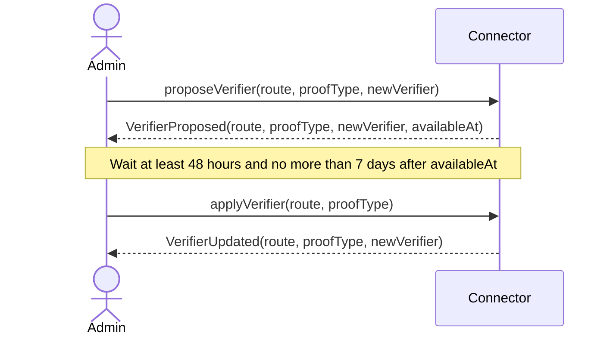
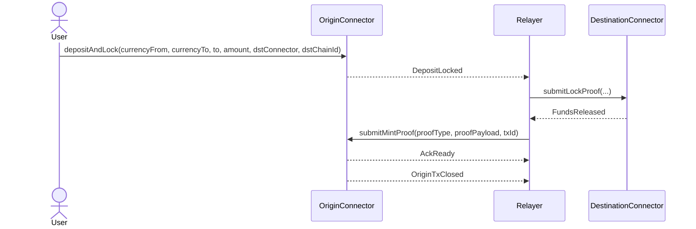
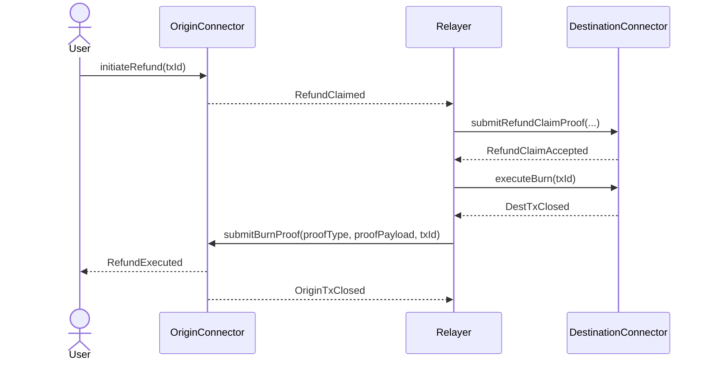
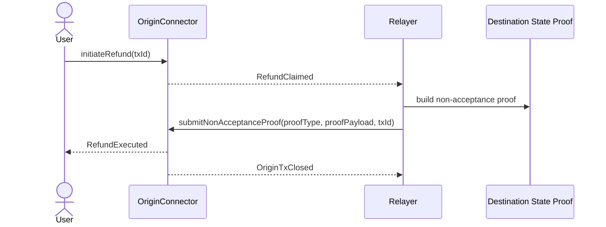
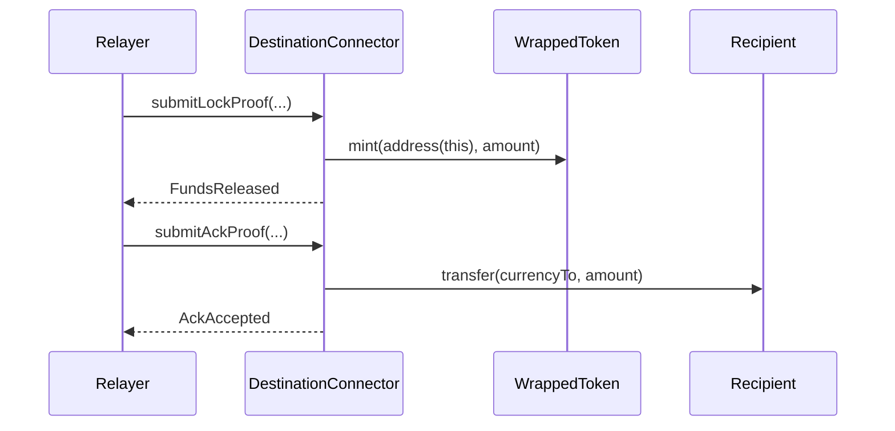

# Connector Contract

Source: `smart-contracts/src/connectors/Connector.sol`

## Overview

`Connector` is the protocol's state machine and custody contract.

The same Solidity contract is deployed on both chains. A deployment acts as an origin connector or destination connector only because of the role it plays in a specific transfer.

Its responsibilities are:

- lock the origin asset
- validate destination wrapped-token routing through `WrappedTokenFactory`
- verify route-specific ZK proof submissions
- mint destination wrapped tokens into connector custody
- release destination wrapped tokens only after origin acknowledgement
- coordinate the refund branch when acknowledgement does not happen in time
- protect the destination lock path with a permanent tombstone at `destinationLockAccepted[txId]`

## Prerequisites

Before a connector can be used safely, the following must already exist:

- a deployed `RiscZeroAdapter`
- a deployed `SnarkAdapter`
- a non-zero ACK window
- a deployed `WrappedTokenFactory`
- route-specific RISC Zero image IDs for the routes enabled on this chain
- destination wrapped-token route registration in the relevant factory

At runtime, the happy path also requires:

- origin sender approval for `depositAndLock`
- a valid destination wrapped token registered for the route
- valid proof payloads whose public inputs match the connector's stored transfer context

## Contract Architecture

### External Dependencies

- `IZKVerifier`: abstraction for proof verification and commitment computation
- `WrappedTokenFactory`: route registry used to validate `currencyTo`
- `IERC20` and `SafeERC20`: source token custody and destination token release
- `IMintableERC20`: mint wrapped tokens into connector custody on destination
- `IBurnableERC20`: burn wrapped tokens on destination during the refund branch
- `ReentrancyGuard`: protects all state-changing entrypoints

### Immutable Configuration

Set once in the constructor:

- `_ADMIN`: only address allowed to change verifier routes
- `_ACK_WINDOW_SECONDS`: copied into each new origin transfer
- `_WRAPPED_TOKEN_FACTORY`: route registry consulted by both deposit and lock-proof submission

### Stored Transfer State

Each live transfer is stored in `_txs[txId]` as `CrossChainTx`:

- transfer identifiers: `txId`, `nonce`
- token addresses: `currencyFrom`, `currencyTo`
- parties: `from`, `to`
- connector pair: `srcChainConnector`, `dstChainConnector`
- timing: `timestamp`, `mintedAt`, `ackDeadline`, `finalizedAt`
- lifecycle state: `status`
- chain pair: `sourceChainId`, `destinationChainId`

Parallel storage:

- `txStatus[txId]`: quick status lookup
- `destinationLockAccepted[txId]`: permanent destination tombstone for replay protection
- `txNonce`: monotonic origin nonce for deriving new `txId` values
- `_verifiers[route][proofType]`: active verifier adapter per route and proof backend
- `_pendingVerifiers[route][proofType]`: pending admin update
- `_pendingVerifierAvailableAt[route][proofType]`: verifier timelock timestamp
- `_risc0RouteImageIds[route]`: expected RISC Zero image ID per route

### Route Matrix

| Route | Used by | Meaning |
| --- | --- | --- |
| `ORIGIN_MINT` | `submitMintProof` | Origin accepts proof that destination reached the mint branch |
| `ORIGIN_BURN` | `submitBurnProof` | Origin accepts proof that destination completed burn-side closure |
| `DEST_LOCK` | `submitLockProof` | Destination accepts proof that origin locked funds |
| `DEST_ACK` | `submitAckProof` | Destination accepts proof that origin acknowledged the mint branch |
| `DEST_REFUND_CLAIM` | `submitRefundClaimProof` | Destination accepts proof that origin entered the refund branch |
| `ORIGIN_NON_ACCEPT` | `submitNonAcceptanceProof` | Origin accepts proof that destination never accepted the lock |

### State Machine

| Status | Meaning | Where used |
| --- | --- | --- |
| `NONE` | no active transfer state | both sides |
| `DEPOSIT_LOCKED` | origin funds locked and awaiting mint proof or refund initiation | origin |
| `REFUND_INITIATED` | origin refund branch activated | origin |
| `MINTED_IN_HOLDING` | destination wrapped tokens minted into connector custody | destination |
| `REFUND_CLAIM_ACCEPTED` | destination accepted the refund-claim proof and can burn | destination |

## Core Functions

### Constructor

#### `constructor(risc0Adapter, snarkAdapter, ackWindowSeconds, risc0RouteImageIds, wrappedTokenFactory)`

What it does:

- stores immutable admin, ACK window, and wrapped-token factory configuration
- seeds every `(route, proofType)` slot with the initial RISC Zero and Snark adapters
- stores the expected RISC Zero image ID for all six verifier routes

Parameters:

| Parameter | Description |
| --- | --- |
| `risc0Adapter` | adapter used as the default verifier for all `RISC0` routes |
| `snarkAdapter` | adapter used as the default verifier for all `SNARKJS` routes |
| `ackWindowSeconds` | global acknowledgement window copied into origin transfers |
| `risc0RouteImageIds` | fixed image ID per `Enums.VerifierRoute` index |
| `wrappedTokenFactory` | route registry used to validate destination currencies |

Prerequisites:

- `risc0Adapter` must be non-zero
- `snarkAdapter` must be non-zero
- `ackWindowSeconds` must be non-zero
- `wrappedTokenFactory` must be non-zero

Emits:

- none

Reverts:

- `ZeroAddress`
- `ZeroAckWindow`

### Verifier Management

#### `proposeVerifier(route, proofType, verifier)`

What it does:

- stages a verifier change for one `(route, proofType)` pair
- starts a fixed `48 hours` timelock before the new verifier can be applied

Parameters:

| Parameter | Description |
| --- | --- |
| `route` | one value from `Enums.VerifierRoute` |
| `proofType` | `RISC0` or `SNARKJS` |
| `verifier` | new adapter address that should become active after the timelock |

Prerequisites:

- caller must be `admin()`
- `verifier` must be non-zero

Emits:

- `VerifierProposed(route, proofType, verifier, availableAt)`

Reverts:

- `NotAdmin`
- `ZeroAddress`

#### `applyVerifier(route, proofType)`

What it does:

- activates the pending verifier for one `(route, proofType)` pair
- clears the pending entry after success

Parameters:

| Parameter | Description |
| --- | --- |
| `route` | verifier route to update |
| `proofType` | proof backend to update |

Prerequisites:

- caller must be `admin()`
- a pending verifier must exist
- current time must be at least `availableAt`
- current time must be no later than `availableAt + 7 days`

Emits:

- `VerifierUpdated(route, proofType, pendingVerifier)`

Reverts:

- `NotAdmin`
- `NoPendingVerifier`
- `TimelockNotExpired`
- `TimelockExpired`

Verifier update sequence:

### Origin-Side Lifecycle

#### `depositAndLock(currencyFrom, currencyTo, to, amount, dstChainConnector, destinationChainId)`

What it does:

- validates user inputs and the destination wrapped-token route
- transfers source tokens into connector custody
- stores a new `CrossChainTx`
- sets `txStatus[txId] = DEPOSIT_LOCKED`
- emits the origin lock event that the relay later proves on destination

Parameters:

| Parameter | Description |
| --- | --- |
| `currencyFrom` | source-chain token locked by the user |
| `currencyTo` | destination wrapped token expected for this route |
| `to` | destination recipient |
| `amount` | requested transfer amount |
| `dstChainConnector` | connector address on the destination chain |
| `destinationChainId` | destination chain ID |

Prerequisites:

- `amount > 0`
- `currencyFrom`, `currencyTo`, `to`, and `dstChainConnector` must be non-zero
- the destination route must already be registered in `WrappedTokenFactory`
- `currencyTo` must equal the route-registered wrapped token
- caller must have approved the connector to pull `currencyFrom`
- token transfer must result in a positive received amount

Emits:

- `DepositLocked`

Reverts:

- `ZeroAmount`
- `ZeroAddress`
- `WrappedTokenNotRegistered`
- `WrappedTokenMismatch`
- `TxAlreadyExists`

Notes:

- the stored transfer amount is the actual amount received by the connector, not blindly the requested `_amount`
- `ackDeadline` is computed as `block.timestamp + ackWindowSeconds()`

#### `submitMintProof(proofType, proofPayload, txId)`

What it does:

- verifies a destination mint proof on the origin chain
- confirms the proof commitment matches the stored transfer context
- closes the origin-side transfer record
- emits `AckReady` and `OriginTxClosed`

Parameters:

| Parameter | Description |
| --- | --- |
| `proofType` | proof backend used by the payload |
| `proofPayload` | ABI-encoded proof payload understood by the selected adapter |
| `txId` | transfer identifier created by `depositAndLock` |

Prerequisites:

- current status must be `DEPOSIT_LOCKED`
- if `proofType == RISC0`, payload image ID must match `getExpectedRisc0ImageId(ORIGIN_MINT)`
- current time must still be strictly before `ackDeadline`
- the active verifier for `(ORIGIN_MINT, proofType)` must exist
- the returned commitment must equal:

`abi.encode(txId, dstChainConnector, amount, to, sourceChainId, destinationChainId)`

Emits:

- `ProofVerified`
- `AckReady`
- `OriginTxClosed`

Reverts:

- `InvalidStateTransition`
- `AckWindowExpired`
- `ImageIdRouteMismatch`
- `VerifierNotRegistered`
- adapter-specific proof errors such as `InvalidSnarkProof` or `ImageIdNotAllowed`
- `CommitmentMismatch`

#### `initiateRefund(txId)`

What it does:

- moves the origin transfer from `DEPOSIT_LOCKED` to `REFUND_INITIATED`
- signals to the relay that the refund branch has started

Parameters:

| Parameter | Description |
| --- | --- |
| `txId` | transfer identifier |

Prerequisites:

- current status must be `DEPOSIT_LOCKED`
- caller must be the original `from` address stored in the transfer
- current time must be at or after `ackDeadline`

Emits:

- `RefundClaimed(txId, from, amount, srcChainConnector)`

Reverts:

- `InvalidStateTransition`
- `NotTxOriginator`
- `AckWindowNotExpired`

#### `submitBurnProof(proofType, proofPayload, txId)`

What it does:

- verifies destination burn completion on the origin chain
- releases the originally locked token back to the origin sender
- closes the origin-side transfer

Parameters:

| Parameter | Description |
| --- | --- |
| `proofType` | proof backend used by the payload |
| `proofPayload` | ABI-encoded proof payload |
| `txId` | transfer identifier |

Prerequisites:

- current status must be `REFUND_INITIATED`
- if `proofType == RISC0`, payload image ID must match `getExpectedRisc0ImageId(ORIGIN_BURN)`
- the active verifier for `(ORIGIN_BURN, proofType)` must exist
- the returned commitment must equal:

`abi.encode(txId, dstChainConnector, amount, sourceChainId, destinationChainId)`

Emits:

- `ProofVerified`
- `RefundExecuted`
- `OriginTxClosed`

Reverts:

- `InvalidStateTransition`
- `ImageIdRouteMismatch`
- `VerifierNotRegistered`
- adapter proof errors
- `CommitmentMismatch`

#### `submitNonAcceptanceProof(proofType, proofPayload, txId)`

What it does:

- verifies that destination never accepted the origin lock before the copied acknowledgement deadline
- uses that proof to refund the original asset directly on origin without requiring destination burn completion

Parameters:

| Parameter | Description |
| --- | --- |
| `proofType` | proof backend used by the payload |
| `proofPayload` | ABI-encoded proof payload |
| `txId` | transfer identifier |

Prerequisites:

- current status must be `REFUND_INITIATED`
- if `proofType == RISC0`, payload image ID must match `getExpectedRisc0ImageId(ORIGIN_NON_ACCEPT)`
- the active verifier for `(ORIGIN_NON_ACCEPT, proofType)` must exist
- the returned commitment must equal:

`abi.encode(txId, dstChainConnector, ackDeadline, sourceChainId, destinationChainId)`

Emits:

- `ProofVerified`
- `RefundExecuted`
- `OriginTxClosed`

Reverts:

- `InvalidStateTransition`
- `ImageIdRouteMismatch`
- `VerifierNotRegistered`
- adapter proof errors
- `CommitmentMismatch`

Origin happy-path sequence:

Origin refund sequences:

### Destination-Side Lifecycle

#### `submitLockProof(proofType, proofPayload, txId, amount, currencyFrom, currencyTo, from, to, srcChainConnector, originAckDeadline, nonce, sourceChainId)`

What it does:

- verifies the origin lock event on destination
- enforces that the destination token for the proven route is the registered wrapper
- marks `destinationLockAccepted[txId] = true`
- stores destination-side transfer state as `MINTED_IN_HOLDING`
- mints wrapped tokens into connector custody
- emits `FundsReleased`

Parameters:

| Parameter | Description |
| --- | --- |
| `proofType` | proof backend used by the payload |
| `proofPayload` | ABI-encoded proof payload |
| `txId` | transfer identifier created on origin |
| `amount` | proven transfer amount |
| `currencyFrom` | origin token address |
| `currencyTo` | destination wrapped token address |
| `from` | origin sender |
| `to` | destination recipient |
| `srcChainConnector` | connector address on the origin chain |
| `originAckDeadline` | deadline copied from origin |
| `nonce` | origin transfer nonce |
| `sourceChainId` | source chain ID |

Prerequisites:

- if `proofType == RISC0`, payload image ID must match `getExpectedRisc0ImageId(DEST_LOCK)`
- `destinationLockAccepted[txId]` must still be `false`
- `txStatus[txId]` must currently be `NONE`
- current time must be strictly before `originAckDeadline`
- the route must be registered in `WrappedTokenFactory`
- `currencyTo` must equal the route-registered wrapped token
- the active verifier for `(DEST_LOCK, proofType)` must exist
- the returned commitment must equal the encoded `ProofOutputs.LockProofPublicInputs`

Emits:

- `ProofVerified`
- `FundsReleased`

Reverts:

- `ImageIdRouteMismatch`
- `DestinationLockAlreadyAccepted`
- `TxAlreadyExists`
- `AckWindowExpired`
- `WrappedTokenNotRegistered`
- `WrappedTokenMismatch`
- `VerifierNotRegistered`
- adapter proof errors
- `CommitmentMismatch`

#### `submitAckProof(proofType, proofPayload, txId)`

What it does:

- verifies that origin accepted the mint branch
- transfers the wrapped tokens from connector custody to the destination recipient
- closes the destination-side transfer

Parameters:

| Parameter | Description |
| --- | --- |
| `proofType` | proof backend used by the payload |
| `proofPayload` | ABI-encoded proof payload |
| `txId` | transfer identifier |

Prerequisites:

- current status must be `MINTED_IN_HOLDING`
- if `proofType == RISC0`, payload image ID must match `getExpectedRisc0ImageId(DEST_ACK)`
- current time must still be strictly before `ackDeadline`
- the active verifier for `(DEST_ACK, proofType)` must exist
- the returned commitment must equal:

`abi.encode(txId, srcChainConnector, dstChainConnector, sourceChainId, destinationChainId)`

Emits:

- `ProofVerified`
- `AckAccepted`

Reverts:

- `InvalidStateTransition`
- `AckWindowExpired`
- `ImageIdRouteMismatch`
- `VerifierNotRegistered`
- adapter proof errors
- `CommitmentMismatch`

#### `submitRefundClaimProof(proofType, proofPayload, txId)`

What it does:

- proves on destination that origin has started the refund branch
- moves the destination transfer into `REFUND_CLAIM_ACCEPTED`

Parameters:

| Parameter | Description |
| --- | --- |
| `proofType` | proof backend used by the payload |
| `proofPayload` | ABI-encoded proof payload |
| `txId` | transfer identifier |

Prerequisites:

- current status must be `MINTED_IN_HOLDING`
- if `proofType == RISC0`, payload image ID must match `getExpectedRisc0ImageId(DEST_REFUND_CLAIM)`
- current time must be at or after `ackDeadline`
- the active verifier for `(DEST_REFUND_CLAIM, proofType)` must exist
- the returned commitment must equal:

`abi.encode(txId, srcChainConnector, amount, sourceChainId, destinationChainId)`

Emits:

- `ProofVerified`
- `RefundClaimAccepted`

Reverts:

- `InvalidStateTransition`
- `AckWindowNotExpired`
- `ImageIdRouteMismatch`
- `VerifierNotRegistered`
- adapter proof errors
- `CommitmentMismatch`

#### `executeBurn(txId)`

What it does:

- burns the wrapped tokens still held by the destination connector
- closes the destination-side transfer after refund claim acceptance

Parameters:

| Parameter | Description |
| --- | --- |
| `txId` | transfer identifier |

Prerequisites:

- current status must be `REFUND_CLAIM_ACCEPTED`
- the destination token must implement `burn(uint256)`
- the connector must still hold the wrapped balance for the transfer amount

Emits:

- `DestTxClosed`

Reverts:

- `InvalidStateTransition`
- token-specific burn failures

Destination sequence:

## View Functions

### Explicit View Methods

| Function | What it returns | Notes |
| --- | --- | --- |
| `getVerifier(route, proofType)` | active verifier adapter address | indexed by route and proof backend |
| `getPendingVerifier(route, proofType)` | pending verifier address and `availableAt` timestamp | used for the admin timelock flow |
| `getExpectedRisc0ImageId(route)` | expected route image ID | checked only for `ProofType.RISC0` |
| `admin()` | immutable admin address | backward-compatible getter |
| `ackWindowSeconds()` | immutable ACK window duration | copied into origin transfers as `ackDeadline` offset |
| `wrappedTokenFactory()` | factory used for route validation | immutable constructor dependency |
| `getTx(txId)` | full `CrossChainTx` snapshot | returns zeroed fields after cleanup |

### Solidity-Generated Public Getters

| Getter | What it returns |
| --- | --- |
| `txStatus(txId)` | current `Enums.TxStatus` value |
| `destinationLockAccepted(txId)` | whether destination ever accepted the lock for that `txId` |
| `txNonce()` | next origin nonce to be used by `depositAndLock` |

## Additional Information

### Events By Function

| Function | Events |
| --- | --- |
| `proposeVerifier` | `VerifierProposed` |
| `applyVerifier` | `VerifierUpdated` |
| `depositAndLock` | `DepositLocked` |
| `submitMintProof` | `ProofVerified`, `AckReady`, `OriginTxClosed` |
| `initiateRefund` | `RefundClaimed` |
| `submitBurnProof` | `ProofVerified`, `RefundExecuted`, `OriginTxClosed` |
| `submitNonAcceptanceProof` | `ProofVerified`, `RefundExecuted`, `OriginTxClosed` |
| `submitLockProof` | `ProofVerified`, `FundsReleased` |
| `submitAckProof` | `ProofVerified`, `AckAccepted` |
| `submitRefundClaimProof` | `ProofVerified`, `RefundClaimAccepted` |
| `executeBurn` | `DestTxClosed` |

### Commitment Inputs By Proof Route

| Route | Expected public inputs |
| --- | --- |
| `ORIGIN_MINT` | `abi.encode(txId, dstChainConnector, amount, to, sourceChainId, destinationChainId)` |
| `ORIGIN_BURN` | `abi.encode(txId, dstChainConnector, amount, sourceChainId, destinationChainId)` |
| `DEST_LOCK` | `ProofOutputs.encodeLockProof(LockProofPublicInputs(...))` |
| `DEST_ACK` | `abi.encode(txId, srcChainConnector, dstChainConnector, sourceChainId, destinationChainId)` |
| `DEST_REFUND_CLAIM` | `abi.encode(txId, srcChainConnector, amount, sourceChainId, destinationChainId)` |
| `ORIGIN_NON_ACCEPT` | `abi.encode(txId, dstChainConnector, ackDeadline, sourceChainId, destinationChainId)` |

### Replay And Safety Notes

- `destinationLockAccepted[txId]` is never cleared, even after `submitAckProof` or `executeBurn`.
- That tombstone prevents a completed destination transfer from being recreated with the same `txId`.
- The connector does not cache proof hashes long term. The durable replay boundary is the destination tombstone plus route-specific commitment checks.
- Route validation is enforced twice: once on origin deposit and once on destination lock proof.
- The connector documents and enforces the current code behavior that `submitAckProof` must arrive before `ackDeadline`.

### Common Custom Errors

| Error | Meaning |
| --- | --- |
| `ZeroAddress` | required address parameter was zero |
| `ZeroAmount` | transfer or received amount was zero |
| `NotAdmin` | caller is not the connector admin |
| `InvalidStateTransition` | function was called in the wrong transfer state |
| `NotTxOriginator` | caller is not the original sender for refund initiation |
| `AckWindowNotExpired` | refund branch was attempted too early |
| `AckWindowExpired` | time-sensitive stage was attempted too late |
| `WrappedTokenNotRegistered` | no wrapped token is registered for the route |
| `WrappedTokenMismatch` | supplied destination token does not match the registered wrapper |
| `DestinationLockAlreadyAccepted` | destination lock path has already been completed for this `txId` |
| `VerifierNotRegistered` | active verifier adapter is missing for the route and proof backend |
| `ImageIdRouteMismatch` | RISC Zero proof image ID does not match the configured route image |
| `CommitmentMismatch` | proof was valid, but not for this exact transfer context |
