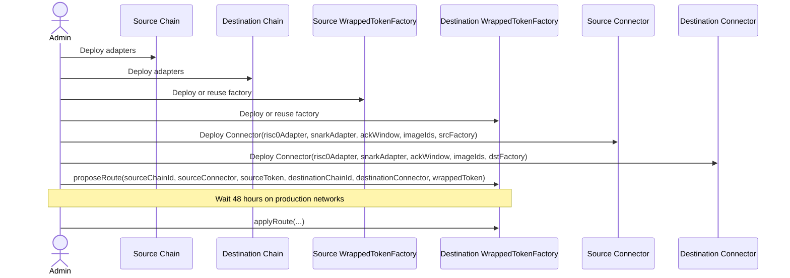

# Deployment Guide

## Overview

The smart-contract deployment flow has four moving parts:

1. Verifier adapters for the proof backends used on each chain.
2. A `WrappedTokenFactory` on each chain.
3. A `Connector` on each chain wired to the correct adapters, ACK window, and route-specific RISC Zero image IDs.
4. Route bootstrap on the destination factory so the connector can only mint the expected wrapped token for a canonical route.

This repository supports both:

- local development deployments through `make` targets and mock verifiers
- production-style deployments through Foundry scripts with pre-deployed or freshly deployed adapters

## Prerequisites

- Foundry installed: `forge`, `cast`, `anvil`
- Node.js and npm installed for Solhint and workspace tooling
- `smart-contracts/.env` populated with the variables required by the path you want to run
- a funded deployer key in `PRIVATE_KEY`
- two different chain IDs for a two-chain deployment
- route-specific RISC Zero image IDs aligned with the current `zk-proofs/risc_zero` guests

For local development, the default chain pairing in this repository is:

- source chain: `31337`
- destination chain: `31338`

## Main Scripts And Targets

### Local / mock deployment

- `script/Connector.s.sol`
- `make deploy-all`
- `make deploy-connectors`
- `make deploy-source-connector`
- `make deploy-dest-connector`
- `make bootstrap`
- `make seed-test-data`

`script/Connector.s.sol` deploys mock verifier contracts, wraps them in `RiscZeroAdapter` and `SnarkAdapter`, deploys a new `WrappedTokenFactory`, and then deploys a `Connector`.

### Production-style deployment

- `script/DeployRiscZeroAdapter.s.sol`
- `script/DeployConnectorWithAdapters.s.sol`
- `make deploy-connectors-prod`

`DeployConnectorWithAdapters.s.sol` expects pre-deployed adapter addresses unless a wrapped-token factory is omitted, in which case it deploys a new one.

## Required Environment Variables

### Shared

- `PRIVATE_KEY`: deployer key used by Foundry broadcasts
- `ACK_WINDOW_SECONDS` or per-chain `ACK_WINDOW_SECONDS_SOURCE` and `ACK_WINDOW_SECONDS_DEST`

### Local two-chain setup

- `RPC_URL_SOURCE`
- `RPC_URL_DEST`
- `SOURCE_CHAIN_ID`
- `DEST_CHAIN_ID`

After stage 1 deployment you also need:

- `SOURCE_CONNECTOR`
- `DEST_CONNECTOR`
- `SOURCE_TOKEN`
- `DEST_WRAPPED_TOKEN_FACTORY`
- `DEST_WRAPPED_TOKEN`

### Production connector deployment

- `RPC_URL_SOURCE`
- `RPC_URL_DEST`
- `RISC0_ADAPTER_SOURCE`
- `SNARK_ADAPTER_SOURCE`
- `RISC0_ADAPTER_DEST`
- `SNARK_ADAPTER_DEST`

Optional:

- `WRAPPED_TOKEN_FACTORY_SOURCE`
- `WRAPPED_TOKEN_FACTORY_DEST`

### RISC Zero route image IDs

The connector constructor takes a fixed `bytes32[6]` array indexed by `Enums.VerifierRoute`.

| Route index | Route enum | Env var |
| --- | --- | --- |
| `0` | `ORIGIN_MINT` | `ORIGIN_MINT_IMAGE_ID` |
| `1` | `ORIGIN_BURN` | `ORIGIN_BURN_IMAGE_ID` |
| `2` | `DEST_LOCK` | `DEST_LOCK_IMAGE_ID` |
| `3` | `DEST_ACK` | `DEST_ACK_IMAGE_ID` |
| `4` | `DEST_REFUND_CLAIM` | `DEST_REFUND_CLAIM_IMAGE_ID` |
| `5` | `ORIGIN_NON_ACCEPT` | `ORIGIN_NON_ACCEPT_IMAGE_ID` |

Unused routes on a chain can be set to `bytes32(0)`, but any route that will accept RISC Zero proofs must be configured consistently across:

- the guest image built in `zk-proofs/risc_zero`
- the deployed `RiscZeroAdapter` allowlist
- the connector's `_risc0RouteImageIds` slot for that route

## Local Two-Chain Deployment

### 1. Start both chains

```bash
anvil --port 8545 --chain-id 31337
```

```bash
anvil --port 8546 --chain-id 31338
```

### 2. Deploy tokens and connectors

From `smart-contracts/`:

```bash
make deploy-all
```

This deploys:

- a mock source ERC-20
- a mock destination ERC-20
- a `WrappedTokenFactory` on each chain
- a `Connector` on each chain
- mock verifier backends wrapped by `RiscZeroAdapter` and `SnarkAdapter`

Note:

- the local flow uses a mintable and burnable `MockERC20` as the destination route token for convenience
- for a stricter production wrapper, deploy `BridgeWrappedToken` and register that in the destination factory

### 3. Print addresses

```bash
make addresses
```

Copy the printed values into `smart-contracts/.env` for bootstrap:

- `SOURCE_CONNECTOR`
- `DEST_CONNECTOR`
- `SOURCE_TOKEN`
- `DEST_WRAPPED_TOKEN_FACTORY`
- `DEST_WRAPPED_TOKEN`

### 4. Register the destination wrapped-token route

```bash
make bootstrap
```

This runs:

1. `script/bootstrap/ProposeRoutes.s.sol`
2. local time warp on Anvil by `48 hours + 1 second`
3. `script/bootstrap/ApplyRoutes.s.sol`

The bootstrap step is required because both `depositAndLock` and `submitLockProof` enforce that `currencyTo` matches the route registered in `WrappedTokenFactory`.

### 5. Optionally seed test balances

```bash
make seed-test-data
```

## Production-Style Deployment

### 1. Deploy or reuse adapters

Deploy a RISC Zero adapter with the image IDs used on that chain:

```bash
forge script script/DeployRiscZeroAdapter.s.sol:DeployRiscZeroAdapter \
  --rpc-url "$RPC_URL_SOURCE" \
  --private-key "$PRIVATE_KEY" \
  --broadcast
```

Repeat per chain if the adapter address differs between networks.

For SnarkJS, deploy the underlying verifier contract first and then deploy the adapter that wraps it.

### 2. Deploy connectors wired to adapters

Use `DeployConnectorWithAdapters.s.sol` directly or the package Make target:

```bash
make deploy-connectors-prod
```

Each connector deployment requires:

- a non-zero RISC Zero adapter address
- a non-zero Snark adapter address
- a non-zero ACK window
- a non-zero wrapped-token factory address, or permission for the script to deploy one
- route image IDs that match the routes enabled on that chain

### 3. Bootstrap the destination route

After both connectors and the destination wrapped token exist:

1. call `ProposeRoutes.s.sol` on the destination `WrappedTokenFactory`
2. wait the full 48-hour timelock on real networks
3. call `ApplyRoutes.s.sol`

Without this route registration:

- origin `depositAndLock` will revert with `WrappedTokenNotRegistered` or `WrappedTokenMismatch`
- destination `submitLockProof` will revert with the same route validation errors

## Deployment Sequence



## Post-Deployment Checks

After deployment and bootstrap, verify at least the following:

- `connector.admin()` matches the deployer
- `connector.ackWindowSeconds()` matches the intended ACK window
- `connector.wrappedTokenFactory()` points to the expected factory
- `connector.getVerifier(route, proofType)` returns the intended adapter per route
- `connector.getExpectedRisc0ImageId(route)` matches the deployed guest image
- `factory.resolve(...)` returns the wrapped token expected for the route
- if you are using `BridgeWrappedToken`, `BridgeWrappedToken.CONNECTOR()` equals the destination connector address

## Common Failure Modes

- `ZeroAddress`: missing adapter, factory, or wrapped token address
- `ZeroAckWindow`: ACK window was not configured
- `WrappedTokenNotRegistered`: destination route bootstrap was skipped
- `WrappedTokenMismatch`: wrong destination token was supplied to the connector
- `ImageIdRouteMismatch`: connector route image IDs do not match the proof payload
- `ImageIdNotAllowed`: proof image is not in the adapter allowlist
- `VerifierNotRegistered`: route or proof type does not have an active adapter
- `TimelockNotExpired`: `applyRoute` or `applyVerifier` was called too early

## Additional Information

- `script/Connector.s.sol` is for local and demo deployments only because it uses mock verifiers.
- `DeployRiscZeroAdapter.s.sol` can deploy a real `RiscZeroGroth16Verifier` automatically if `RISC0_VERIFIER` is omitted.
- `DeployConnectorWithAdapters.s.sol` seeds all six route slots in the connector, even if some routes are unused on the target chain.
- The destination route registration is the protocol's guardrail against minting an arbitrary ERC-20 that merely exposes `mint` and `burn`.
