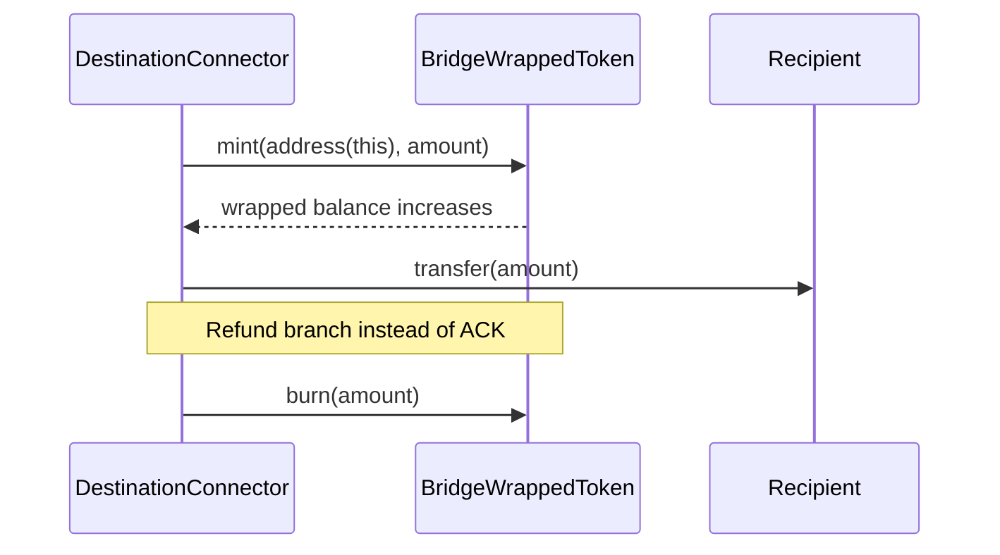

# BridgeWrappedToken Contract

Source: `smart-contracts/src/tokens/BridgeWrappedToken.sol`

## Overview

`BridgeWrappedToken` is the destination-side ERC-20 used by the protocol for wrapped liquidity.

It is intentionally simple:

- it inherits OpenZeppelin `ERC20`
- it stores one immutable connector address
- only that connector may mint or burn supply

This design prevents the bridge from minting arbitrary third-party tokens and prevents third parties from minting bridge supply themselves.

## Prerequisites

- a destination connector address must already be known at deployment time
- the connector address must be non-zero
- the token should be registered in `WrappedTokenFactory` for the route before users start bridging

## Contract Architecture

### Inheritance

- `ERC20` from OpenZeppelin

### Immutable Configuration

- `CONNECTOR`: only caller allowed to mint or burn

### Mint And Burn Model

- `submitLockProof` on destination calls `mint(address(this), amount)` through the connector
- `submitAckProof` later transfers those tokens from the connector to the user
- `executeBurn` calls `burn(amount)` while the connector still holds the wrapped balance

## Core Functions

### `constructor(name_, symbol_, connector_)`

What it does:

- initializes the ERC-20 metadata
- stores the immutable connector address

Parameters:

| Parameter | Description |
| --- | --- |
| `name_` | token name |
| `symbol_` | token symbol |
| `connector_` | connector allowed to mint and burn |

Prerequisites:

- `connector_` must be non-zero

Emits:

- standard ERC-20 constructor behavior only

Reverts:

- `ZeroAddress`

### `mint(to, amount)`

What it does:

- mints wrapped tokens to `to`
- intended caller is the destination connector

Parameters:

| Parameter | Description |
| --- | --- |
| `to` | recipient of minted supply |
| `amount` | amount of wrapped tokens to mint |

Prerequisites:

- caller must equal `CONNECTOR`

Emits:

- standard ERC-20 `Transfer(address(0), to, amount)`

Reverts:

- `NotAdmin`

### `burn(amount)`

What it does:

- burns wrapped tokens from the caller balance
- intended caller is the destination connector while it still holds custody

Parameters:

| Parameter | Description |
| --- | --- |
| `amount` | amount of wrapped tokens to burn |

Prerequisites:

- caller must equal `CONNECTOR`

Emits:

- standard ERC-20 `Transfer(CONNECTOR, address(0), amount)`

Reverts:

- `NotAdmin`

Mint and burn sequence:

## View Functions

### Custom Getter

| Function | What it returns |
| --- | --- |
| `CONNECTOR()` | immutable connector address |

### Inherited ERC-20 View Functions

Because the contract inherits OpenZeppelin `ERC20`, it also exposes the standard ERC-20 read surface:

- `name()`
- `symbol()`
- `decimals()`
- `totalSupply()`
- `balanceOf(account)`
- `allowance(owner, spender)`

## Additional Information

### Operational Notes

- The token does not implement its own access-control system beyond the single immutable connector.
- `burn(amount)` burns from `msg.sender`, not from an arbitrary account. That matches the connector custody model.
- By default OpenZeppelin `ERC20` uses `18` decimals.
- The repository's local deployment scripts may use a mintable `MockERC20` as the destination route token for fast testing. The production wrapper contract documented here is the tighter design intended for real route-bound wrapped supply.

### Common Errors

| Error | Meaning |
| --- | --- |
| `ZeroAddress` | connector passed to the constructor was zero |
| `NotAdmin` | caller is not the registered connector |
