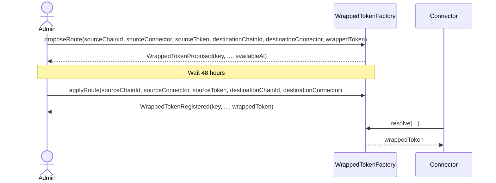

# WrappedTokenFactory Contract

Source: `smart-contracts/src/tokens/WrappedTokenFactory.sol`

## Overview

`WrappedTokenFactory` is the registry that binds a canonical bridge route to exactly one wrapped token address.

The canonical route is:

`(sourceChainId, sourceConnector, sourceToken, destinationChainId, destinationConnector)`

`Connector.depositAndLock` and `Connector.submitLockProof` both consult this contract. That makes route registration a protocol requirement, not just deployment metadata.

## Prerequisites

- the factory must be deployed before the connector that references it is deployed
- the admin account must remain available to propose and apply route registrations
- the destination wrapped token must already exist before `proposeRoute`
- the route to register must not already be active

## Contract Architecture

### Immutable Configuration

- `ADMIN`: the only address allowed to propose or apply route registrations

### Storage Layout

- `_wrappedTokens[key]`: active wrapped token per route key
- `_pendingWrappedTokens[key]`: pending proposal per route key
- `_pendingAvailableAt[key]`: timestamp when `applyRoute` may be called

### Route Key

The factory hashes the full canonical route with:

`keccak256(abi.encode(sourceChainId, sourceConnector, sourceToken, destinationChainId, destinationConnector))`

The destination token is not part of the key because it is the resolved value stored against that route.

## Core Functions

### `constructor()`

What it does:

- stores `msg.sender` as immutable `ADMIN`

Parameters:

- none

Prerequisites:

- none

Emits:

- none

Reverts:

- none

### `proposeRoute(sourceChainId, sourceConnector, sourceToken, destinationChainId, destinationConnector, wrappedToken)`

What it does:

- stages a wrapped-token registration for one canonical route
- starts a `48 hours` timelock before activation

Parameters:

| Parameter | Description |
| --- | --- |
| `sourceChainId` | source chain ID |
| `sourceConnector` | source connector address |
| `sourceToken` | source token address |
| `destinationChainId` | destination chain ID |
| `destinationConnector` | destination connector address |
| `wrappedToken` | destination wrapped token to bind to this route |

Prerequisites:

- caller must be `ADMIN`
- `wrappedToken` must be non-zero
- route must not already have an active registration

Emits:

- `WrappedTokenProposed`

Reverts:

- `NotAdmin`
- `ZeroAddress`
- `RouteAlreadyRegistered`

### `applyRoute(sourceChainId, sourceConnector, sourceToken, destinationChainId, destinationConnector)`

What it does:

- activates the pending route registration after the timelock
- moves the pending wrapped token into the active registry

Parameters:

| Parameter | Description |
| --- | --- |
| `sourceChainId` | source chain ID |
| `sourceConnector` | source connector address |
| `sourceToken` | source token address |
| `destinationChainId` | destination chain ID |
| `destinationConnector` | destination connector address |

Prerequisites:

- caller must be `ADMIN`
- a pending proposal must exist for the route
- current time must be at least the stored `availableAt`

Emits:

- `WrappedTokenRegistered`

Reverts:

- `NotAdmin`
- `NoPendingRoute`
- `TimelockNotExpired`

Route registration sequence:

## View Functions

| Function | What it returns | Notes |
| --- | --- | --- |
| `resolve(sourceChainId, sourceConnector, sourceToken, destinationChainId, destinationConnector)` | active wrapped token or `address(0)` | primary lookup used by the connector |
| `routeKey(sourceChainId, sourceConnector, sourceToken, destinationChainId, destinationConnector)` | canonical route key hash | useful for off-chain tooling and error decoding |
| `ADMIN()` | admin address | generated from the public immutable state variable |

## Additional Information

### Events

| Event | Meaning |
| --- | --- |
| `WrappedTokenProposed` | a route registration is pending and waiting for the timelock |
| `WrappedTokenRegistered` | a route registration is now active |

### Operational Notes

- The contract does not support updating or deleting an already active route.
- A route proposal does not affect connector behavior until `applyRoute` succeeds.
- Both origin `depositAndLock` and destination `submitLockProof` will fail until the destination route is active.
- Tests use a harness that overrides the timelock to `0`, but the production contract hardcodes `48 hours`.

### Common Errors

| Error | Meaning |
| --- | --- |
| `NotAdmin` | caller is not the factory admin |
| `ZeroAddress` | wrapped token argument is zero |
| `RouteAlreadyRegistered` | active route already exists |
| `NoPendingRoute` | no proposal exists for the route |
| `TimelockNotExpired` | `applyRoute` was called too early |
