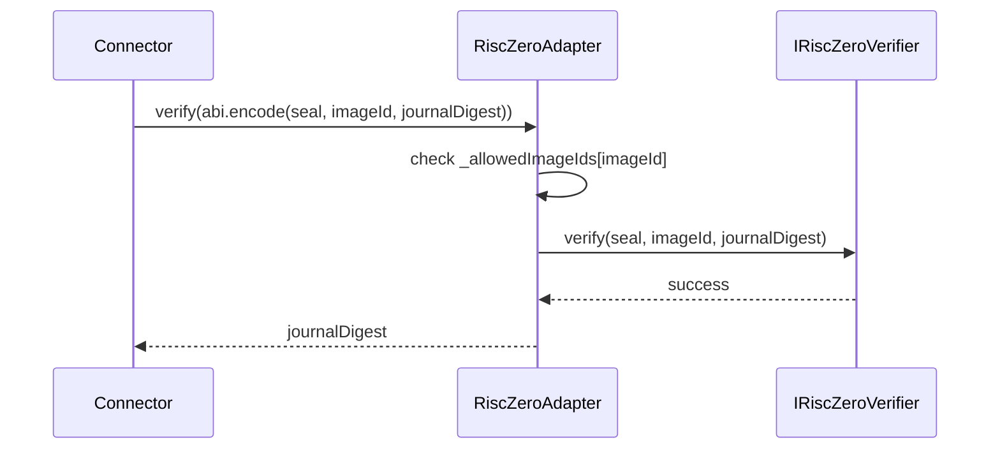
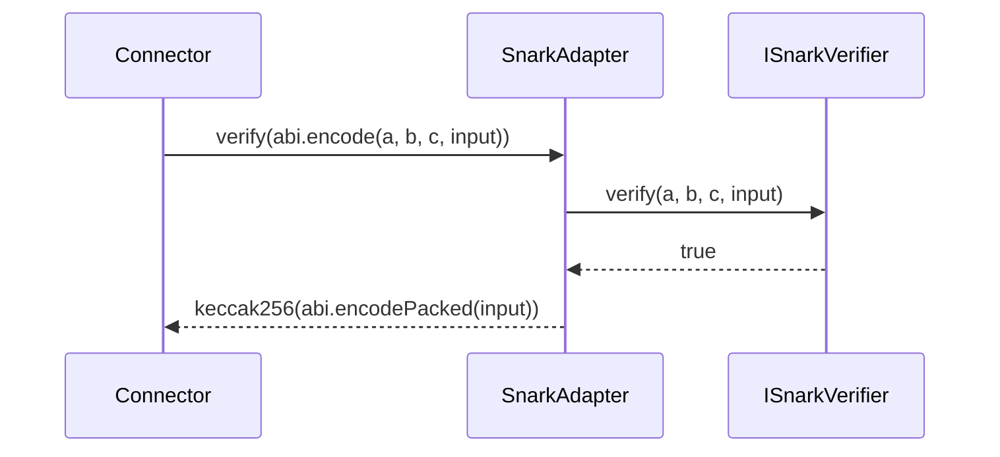

# Verifier Adapters

Sources:

- `smart-contracts/src/zk-proof/adapters/RiscZeroAdapter.sol`
- `smart-contracts/src/zk-proof/adapters/SnarkAdapter.sol`
- `smart-contracts/src/zk-proof/IZKVerifier.sol`

## Overview

The connector never talks directly to a proof-system-specific verifier. It talks to `IZKVerifier`.

The adapter contracts provide that bridge:

- `RiscZeroAdapter` wraps `IRiscZeroVerifier`
- `SnarkAdapter` wraps a SnarkJS-generated Groth16 verifier through `ISnarkVerifier`

Both adapters expose the same two methods:

- `verify(bytes proofPayload) returns (bytes32 commitment)`
- `computeCommitment(bytes publicInputs) returns (bytes32 commitment)`

The connector uses:

1. `verify(...)` to validate a submitted proof and recover its commitment
2. `computeCommitment(...)` to recompute what the commitment should be for the live transfer context

## RiscZeroAdapter

### Prerequisites

- a deployed RISC Zero verifier contract
- at least one allowed image ID
- no image ID in the allowlist may be zero

### Contract Architecture

- immutable `_RISC0_VERIFIER`: underlying verifier contract
- `_allowedImageIds[imageId]`: allowlist of guest programs this adapter accepts

The adapter intentionally supports multiple image IDs so one adapter can serve all active routes on one chain.

### Core Functions

#### `constructor(verifier, imageIds)`

What it does:

- stores the wrapped RISC Zero verifier
- seeds the allowlist of permitted image IDs

Parameters:

| Parameter | Description |
| --- | --- |
| `verifier` | deployed `IRiscZeroVerifier` implementation |
| `imageIds` | list of guest image IDs this adapter may accept |

Prerequisites:

- `verifier` must be non-zero
- `imageIds.length` must be greater than zero
- every image ID must be non-zero

Emits:

- none

Reverts:

- `ZeroAddress`
- `EmptyAllowlist`
- `AllowedImageIdsRiscZeroIsZeroAddress`

#### `verify(proofPayload)`

What it does:

- decodes the payload as `(bytes seal, bytes32 imageId, bytes32 journalDigest)`
- checks the image ID allowlist
- calls the underlying RISC Zero verifier
- returns `journalDigest` as the commitment

Parameters:

| Parameter | Description |
| --- | --- |
| `proofPayload` | ABI-encoded `(seal, imageId, journalDigest)` tuple |

Prerequisites:

- `imageId` must be allowed by this adapter
- the underlying verifier must accept the proof

Emits:

- none

Reverts:

- `ImageIdNotAllowed`
- any revert bubbled from the underlying RISC Zero verifier

#### `computeCommitment(publicInputs)`

What it does:

- returns `sha256(publicInputs)`

Parameters:

| Parameter | Description |
| --- | --- |
| `publicInputs` | ABI-encoded public inputs used to derive the expected journal digest |

Prerequisites:

- none

Emits:

- none

This matches the commitment returned by `verify`, because the RISC Zero journal digest is expected to equal the SHA-256 hash of the ABI-encoded public inputs.

RISC Zero adapter sequence:

### View Functions

| Function | What it returns |
| --- | --- |
| `risc0Verifier()` | wrapped verifier address |
| `isImageIdAllowed(imageId)` | whether an image ID is allowlisted |

### Additional Information

- The connector performs another route-specific image check before calling the adapter. The adapter allowlist is broader, while the connector route binding is narrower.
- A proof can be allowlisted by the adapter and still fail at the connector if the route-specific expected image ID is different.

## SnarkAdapter

### Prerequisites

- a deployed Groth16 verifier contract generated for the expected circuit

### Contract Architecture

- immutable `_SNARK_VERIFIER`: wrapped Groth16 verifier

### Core Functions

#### `constructor(verifier)`

What it does:

- stores the wrapped verifier address

Parameters:

| Parameter | Description |
| --- | --- |
| `verifier` | deployed Groth16 verifier contract |

Prerequisites:

- `verifier` must be non-zero

Emits:

- none

Reverts:

- `ZeroAddress`

#### `verify(proofPayload)`

What it does:

- decodes the payload as `(uint256[2] a, uint256[2][2] b, uint256[2] c, uint256[] input)`
- calls the wrapped verifier
- returns `keccak256(abi.encodePacked(input))` as the commitment

Parameters:

| Parameter | Description |
| --- | --- |
| `proofPayload` | ABI-encoded `(a, b, c, input)` Groth16 payload |

Prerequisites:

- the wrapped verifier must return `true`

Emits:

- none

Reverts:

- `InvalidSnarkProof`

#### `computeCommitment(publicInputs)`

What it does:

- returns `keccak256(publicInputs)`

Parameters:

| Parameter | Description |
| --- | --- |
| `publicInputs` | ABI-encoded public inputs used by the connector for route binding |

Prerequisites:

- none

Emits:

- none

The connector must use the same ABI encoding for public inputs that the off-chain proof generation pipeline expects, otherwise the proof can be valid but the connector will still revert with `CommitmentMismatch`.

Snark adapter sequence:

### View Functions

| Function | What it returns |
| --- | --- |
| `snarkVerifier()` | wrapped verifier address |

## Shared Additional Information

### Why The Connector Needs Both `verify` And `computeCommitment`

`verify` answers:

- "Is this proof structurally valid for the wrapped proof system?"

`computeCommitment` answers:

- "What commitment should a valid proof for this exact transfer context produce?"

The connector only accepts a proof when both answers line up.

### Common Errors

| Error | Where used | Meaning |
| --- | --- | --- |
| `ZeroAddress` | both adapters | wrapped verifier address was zero |
| `EmptyAllowlist` | `RiscZeroAdapter` | no image IDs were provided |
| `AllowedImageIdsRiscZeroIsZeroAddress` | `RiscZeroAdapter` | an allowlist entry was zero |
| `ImageIdNotAllowed` | `RiscZeroAdapter` | proof image is not on the adapter allowlist |
| `InvalidSnarkProof` | `SnarkAdapter` | wrapped verifier returned `false` |
